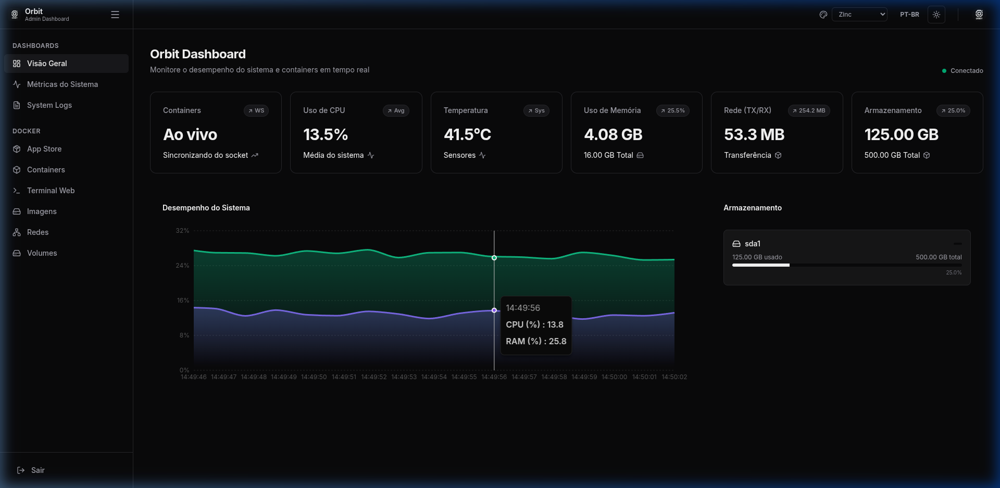
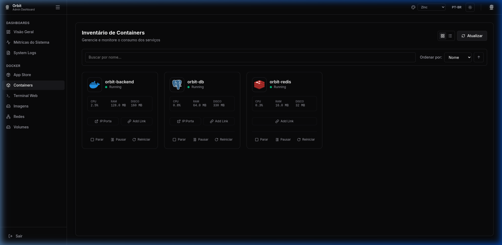
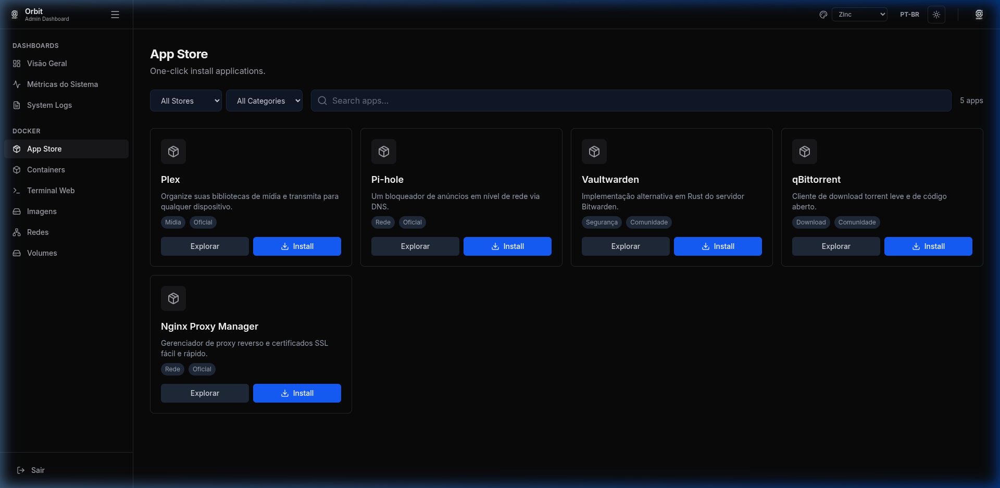
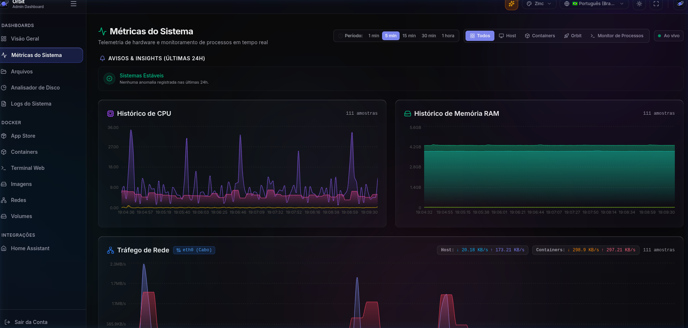
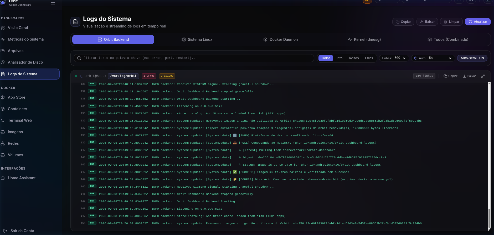
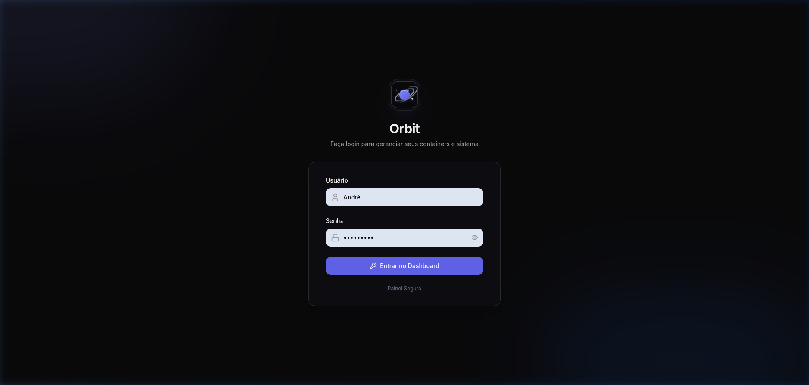

<div align="center">

# 🪐 Orbit Dashboard

**Um painel moderno, ultraleve e de alto desempenho para orquestração de contêineres Docker e telemetria de hardware local.**

[](https://github.com/Andrevictor20/orbit-dashboard/actions/workflows/ci.yml)
[-blue?logo=docker)](https://github.com/Andrevictor20/orbit-dashboard/pkgs/container/orbit-dashboard)
[](https://www.rust-lang.org/)
[](https://react.dev/)
[](https://tailwindcss.com/)
[](LICENSE)

<br/>

[🚀 Início Rápido](#-início-rápido) •
[✨ Funcionalidades](#-funcionalidades) •
[🏛️ Arquitetura](#-arquitetura) •
[🛡️ Segurança](#-segurança) •
[🧪 Testes](#-testes) •
[🤝 Créditos & Inspiração](#-créditos--inspiração) •
[📚 Documentação](#-documentação-completa)

</div>

---

## 📸 Demonstração Visual

<div align="center">

### 🌌 Visão Geral & Telemetria em Tempo Real


</div>

<details>
<summary><b>🔍 Clique para ver mais capturas de tela do sistema</b></summary>
<br/>

| Tela | Prévia |
| :--- | :--- |
| **📦 Gerenciamento de Contêineres** |  |
| **🛍️ App Store (1-Click Install)** |  |
| **📈 Gráficos Detalhados de Métricas** |  |
| **📋 Logs Centralizados do Sistema** |  |
| **🔐 Tela de Login & Segurança** |  |

</details>

---

## ✨ Funcionalidades Principais

- ⚡ **Desempenho Ultrarrápido:** Backend assíncrono em **Rust (Axum + Tokio)** consumindo menos de 15MB de memória RAM em repouso.
- 📊 **Telemetria ao Vivo via WebSockets:** Gráficos interativos de CPU, Memória, I/O de Disco, Tráfego de Rede e Temperatura em tempo real.
- 📦 **Controle Total do Docker:** Inicie, pare, reinicie, pause, visualize logs, edite variáveis de ambiente e mapeamentos de volumes sem sair do navegador.
- 🛍️ **App Store Integrada:** Instale aplicações *self-hosted* populares (Pi-hole, Plex, Vaultwarden, Nginx Proxy Manager) com 1 clique.
- 💻 **Terminal Web (Xterm.js):** Acesso direto ao shell do sistema host e `docker exec` interativo no navegador.
- 🛡️ **Segurança Zero-Config:** Autenticação resistente com **Argon2id**, auto-geração de segredos JWT com CSPRNG e proteção contra força bruta (Rate Limiting).
- 🔄 **Continuous Delivery Multi-Arch:** Imagens Docker compiladas automaticamente para arquiteturas **x86_64 (`linux/amd64`)** e **ARM64 (`linux/arm64`)**, ideal para Raspberry Pi e nós edge.

---

## 🚀 Início Rápido (1 Comando)

### ⚡ Instalação Automática (Estilo CasaOS - Recomendado)
Instalação completa e imediata com detecção automática de arquitetura (**ARM64, ARMv7 ou x86_64**), instalação de dependências e Docker se necessário, criação da pasta de dados e inicialização:

```bash
curl -fsSL https://raw.githubusercontent.com/Andrevictor20/orbit-dashboard/main/install.sh | bash
```

---

### 🐳 Instalação Manual via Docker Compose

Caso prefira iniciar manualmente:

```yaml
services:
  orbit:
    image: ghcr.io/andrevictor20/orbit-dashboard:latest
    container_name: orbit
    restart: unless-stopped
    ports:
      - "5172:5172"
    volumes:
      - /var/run/docker.sock:/var/run/docker.sock
      - orbit_data:/app/data
    logging:
      driver: "json-file"
      options:
        max-size: "10m"
        max-file: "3"

volumes:
  orbit_data:
```

```bash
docker compose up -d
```

Acesse **`http://<ip-do-servidor>:5172`** e configure sua conta de administrador no assistente de primeiro acesso.

---

## 🏛️ Arquitetura & Stack Tecnológica

```
┌─────────────────────────────────────────────────────────────┐
│                   Navegador Web (SPA)                       │
│      React 19 + TypeScript + Vite 8 + Tailwind CSS v4       │
└──────────────────────────────┬──────────────────────────────┘
                               │ HTTP REST & WebSockets
┌──────────────────────────────▼──────────────────────────────┐
│                    Orbit Backend Daemon                     │
│                Rust 2021 + Axum + Tokio Runtime             │
├──────────────────────────────┬──────────────────────────────┤
│ Módulo Docker (Bollard API)  │ Módulo Auth (Argon2id + JWT) │
│ Parser Store (CasaOS Schema) │ WebSocket Broadcaster (Sys)  │
└──────────────────────────────┬──────────────────────────────┘
                               │ Unix Domain Socket
┌──────────────────────────────▼──────────────────────────────┐
│              Docker Daemon & Linux Kernel (/proc)           │
└─────────────────────────────────────────────────────────────┘
```

- **Backend:** Rust, Axum, Tokio, Bollard (Docker Client), Sysinfo, Argon2, JsonWebToken.
- **Frontend:** React 19, TypeScript, Vite, Tailwind CSS v4, Recharts, Xterm.js, Lucide Icons.
- **Qualidade & CI:** Vitest, Playwright (E2E e Visual), Grafana k6 (Carga), OWASP ZAP (DAST), Cargo Mutants.

---

## 🤝 Créditos & Inspiração

O design de experiência de usuário e o ecossistema de catálogo de aplicativos do Orbit foram fortemente inspirados pelo projeto de código aberto **[CasaOS](https://casaos.io/)** (da IceWhale Technology). 

Reconhecemos e agradecemos à comunidade do CasaOS pelo excelente trabalho ao popularizar a experiência simplificada de homelabs e o formato declarativo de aplicativos Docker Compose. O Orbit reimagina esses conceitos combinando-os com um backend moderno em **Rust** focado em baixo consumo de memória, segurança corporativa e alto desempenho.

---

## 📚 Documentação Completa

Para se aprofundar em cada aspecto do Orbit, consulte nossos guias dedicados:

- 🏛️ **[docs/ARCHITECTURE.md](docs/ARCHITECTURE.md):** Arquitetura interna, fluxo de dados e design de módulos.
- 🛡️ **[docs/SECURITY.md](docs/SECURITY.md):** Controles de segurança, DevSecOps, Argon2id, headers HTTP e DAST.
- 📦 **[docs/INSTALLATION.md](docs/INSTALLATION.md):** Guia detalhado de instalação via Docker, compilação manual e dev mode.
- 🧪 **[docs/TESTING.md](docs/TESTING.md):** Estratégia de testes, TDD, suíte E2E, carga e pipeline de CI.

---

## 📄 Licença

Distribuído sob a licença **MIT**. Consulte `LICENSE` para mais informações.
