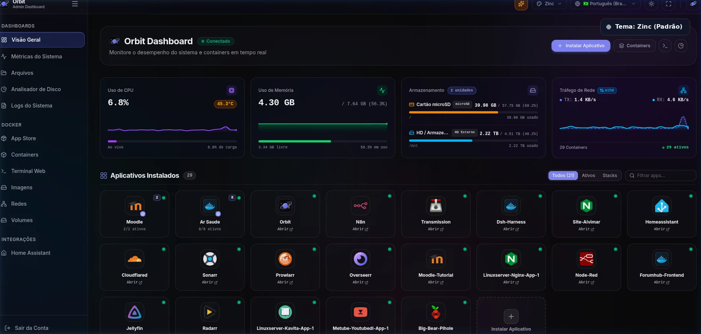
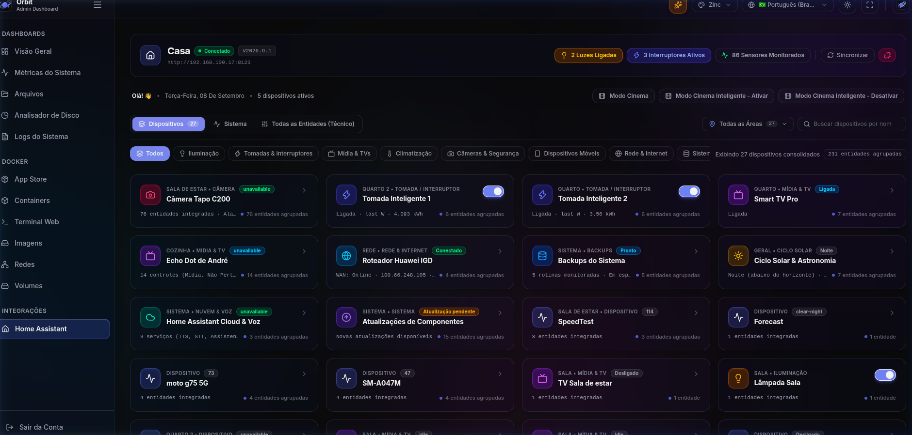

<div align="center">


# Saturn

### O Sistema Operacional Moderno para seu Homelab & Contêineres Docker

**Leve. Ultrarrápido. Desenhado para quem exige controle absoluto e odeia lentidão.**  
*Monitore hardware a 60 FPS, orquestre stacks Compose, publique túneis Cloudflare e instale mais de 920 aplicativos em 1 clique.*

[](https://github.com/Andrevictor20/saturn/actions/workflows/ci.yml)
[-blue?logo=docker)](https://github.com/Andrevictor20/saturn/pkgs/container/saturn)
[](https://hub.docker.com/r/victorandre280/saturn)
[](https://www.rust-lang.org/)
[](https://react.dev/)
[](https://tailwindcss.com/)
[](LICENSE)

<br/>

```bash
# ⚡ Instale o Saturn no seu servidor em menos de 30 segundos
curl -fsSL https://raw.githubusercontent.com/Andrevictor20/saturn/main/install.sh | bash
```

<br/>

[Começar Agora](#-instalação-em-30-segundos) •
[Funcionalidades](#-por-que-o-saturn) •
[Demonstração](#-veja-o-saturn-em-ação) •
[App Store](#-app-store-oficial-saturn-apps) •
[Documentação Completa](#-documentação-técnica-aprofundada)

</div>

---

## ⚡ Instalação em 30 Segundos

Chega de arquivos de configuração intermináveis ou instaladores que quebram no meio do caminho. Com apenas um comando no terminal do seu servidor (Linux PC, Raspberry Pi ou VPS), o Saturn detecta seu hardware, configura permissões, baixa a imagem oficial e entrega seu painel pronto:

```bash
curl -fsSL https://raw.githubusercontent.com/Andrevictor20/saturn/main/install.sh | bash
```

> **Após rodar:** Acesse `http://<ip-do-servidor>:5172` no seu navegador desktop ou celular e crie sua conta de administrador.

Precisa de implantação declarativa com Docker Compose ou quer rodar atrás de um proxy reverso (Nginx, Caddy, Traefik)?  
👉 **[Consulte o Guia Completo de Instalação e Implantação (docs/INSTALLATION.md)](docs/INSTALLATION.md)**

---

## 💎 Por que o Saturn?

Gerenciadores tradicionais de homelab costumam ser lentos, pesados ou atrelados a ecossistemas proprietários fechados. O Saturn foi concebido do zero com padrões rigorosos de engenharia para resolver essas dores:

| O Desafio Comum | A Solução do Saturn |
| :--- | :--- |
| **Painéis pesados que travam:** Dashboards em Python/Node consomem 300MB+ de RAM apenas para exibir gráficos. | **Engine Nativa em Rust:** Consumo de **< 25 MB de RAM** em repouso e zero lag, voando até num Raspberry Pi 3. |
| **Instalar apps às cegas:** Você baixa um contêiner e só descobre que ele não suporta ARM64 depois que ele falha em loop. | **Inteligência de CPU na Loja:** A App Store detecta a CPU do seu servidor e avisa se um app é compatível antes do download. |
| **Conflitos de portas e rotas:** Túneis e links que apontam para o app errado ou misturam subdomínios. | **Roteamento Port-First:** Descoberta determinística de portas com guarda estrita contra conflitos e sincronização Cloudflare. |
| **Processos opacos:** O servidor fica em 100% de uso e você só vê `python3` ou `node` consumindo tudo sem saber qual app é o culpado. | **In-Card Top 5 com Nomes Reais:** O painel cruza o PID do processo com os contêineres Docker e mostra o nome e ícone oficial do app. |
| **Design genérico e cansativo:** Interfaces sem carinho visual ou fundos cinzas que não aproveitam telas modernas. | **Preto OLED Puro & Cores Dinâmicas:** Tema Full Black (`#000000`) com pixels desligados e cores adaptadas do seu wallpaper. |

---

## 🎬 Veja o Saturn em Ação

Uma interface viva, hiper-responsiva e calibrada para touch e teclado, atualizada em tempo real via WebSockets sem exigir recarregamentos de página.

### Visão Geral & Telemetria em Tempo Real
Acompanhe CPU, RAM, conexões ativas, armazenamento multi-disco e temperatura a 60 FPS com histórico contínuo.


### Controle Total de Contêineres & Stacks Compose
Inicie, pause, reinicie, edite composes, inspecione portas e atualize imagens em segundo plano sem travar o navegador.


### Loja com 920+ Apps & Inteligência Multi-Plataforma
Catálogo autônomo e instantâneo com chips de arquitetura, badges de alerta e filtro para a CPU do seu host.


<details>
<summary><b>🔍 Clique para ver mais capturas de tela (Métricas, Terminal, Disco, Temas e Integrações)</b></summary>
<br/>

| Seção | Demonstração Visual |
| :--- | :--- |
| **Histórico Contínuo de Métricas** |  |
| **Analisador de Espaço em Disco** |  |
| **Central de Logs com Busca Instantânea** |  |
| **Terminal Web Integrado (PTY Nativo)** |  |
| **Autenticação Criptografada (Argon2id)** |  |
| **Gerenciador de Arquivos com Prévias Inline** |  |
| **Transição de Temas e Cores Adaptativas** |  |
| **Integração Nativa com Home Assistant** |  |

</details>

---

## ✨ Recursos de Destaque

### 📦 App Store Desacoplada com 920+ Apps Prontos
- **Catálogo Autônomo Oficial (`saturn-apps`):** Mais de 920 aplicações prontas para subir com 1 clique, com composes limpos e sem dependências de terceiros.
- **Detecção de CPU e Alerta de Incompatibilidade:** Identificação automática da CPU (`x86_64` vs `ARM64`) com chips visuais e avisos preventivos para apps exclusivos de PC ou Raspberry Pi.
- **Filtro Inteligente de Arquitetura:** Um clique para listar apenas os apps 100% garantidos para o seu processador.
- **Gerenciador de Repositórios Comunitários:** Adicione e alterne lojas customizadas de terceiros via URL em segundos (`/app/data/stores.json`).
👉 *Saiba como o catálogo funciona e como enviar seus próprios apps:* **[Guia da App Store (docs/APP_STORE.md)](docs/APP_STORE.md)**

### 🖥️ Terminal Web Direto & Shell do Servidor
- **Acesso ao Console com 1 Clique:** Abra o shell nativo do host (`/bin/bash` ou `/bin/sh`) diretamente no navegador com PTY interativo via WebSockets, sem precisar configurar chaves ou portas SSH.
- **Suporte a Proxy SSH:** Conecte-se também a outras máquinas ou contêineres remotos via SSH com segurança e redimensionamento dinâmico de janela.

### 📊 In-Card Top 5 & Mapeamento Amigável de Processos
- **Alternador Integrado no Card:** Alterne entre os medidores visuais de CPU e RAM e a lista dos 5 processos que mais demandam recursos no momento.
- **Identificação Real do Aplicativo:** Chega de adivinhar o que é `python3`, `java` ou `php-fpm`. O Saturn cruza os PIDs com o daemon Docker e exibe o nome amigável e o ícone oficial (ex: *Home Assistant*, *Kavita*, *Jellyfin*).

### 🎬 Streaming Fluido (RFC 7233) & Miniaturas Instantâneas
- **Streaming de Vídeo sem Travamentos:** Suporte a requisições HTTP 206 com busca instantânea de metadados (`Range: bytes=-N`), permitindo reproduzir vídeos em contêineres MP4/MKV e legendas WebVTT com carregamento imediato.
- **Cache Inteligente de Miniaturas:** Geração rápida e cache em disco (SHA-256) para prévias inline de imagens, vídeos e capas de PDFs no gerenciador de arquivos.

### 🛡️ Túneis Cloudflare com Roteamento Port-First
- **Correspondência Confiável:** Vinculação inteligente de rotas com base na porta de rede do contêiner, eliminando associações incorretas por nomes parecidos.
- **Port Conflict Guard:** Blindagem estrita que impede associar serviços a contêineres que não possuam a porta requisitada.
- **Vínculos Manuais Bidirecionais:** Associe ou desvincule contêineres diretamente na tabela de rotas com atualização em tempo real.

### 🔄 Backups de Estado Completo & Restauração Resiliente
- **Snapshot Integral com 1 Clique:** Salve seus arquivos de compose, banco de dados, customizações visuais e todas as integrações (`homeassistant.json`, `cloudflare.json`, `pihole.json`, etc.).
- **Auto-Descoberta de Conteúdo:** Restauração inteligente a partir de arquivos `.tar.gz` de até 10GB, recriando contêineres automaticamente e invalidando caches em memória sem necessidade de reiniciar o sistema.

### 🎨 Design System de Elite & Tema Preto OLED
- **Preto OLED Puro (`#000000`):** Economize energia e alcance contraste infinito em telas OLED e monitores escuros, com cartões em acabamento translúcido premium.
- **Cores Adaptativas do Wallpaper:** Carregue qualquer imagem de fundo e o Saturn extrai automaticamente paletas de acento vivas e calibradas.
- **Paletas Pré-Calibradas:** Alterne instantaneamente entre Zinc, Blue, Rose, Green, Catppuccin e Tokyo Night.

### 🏠 Integrações Nativas Homelab (Home Assistant & Pi-hole)
- **Home Assistant:** Agrupamento inteligente de dispositivos por cômodos/áreas e controle unificado de automações com proxy seguro de tokens.
- **Pi-hole:** Monitore tráfego de DNS, consulte percentual de anúncios bloqueados e ative/desative a proteção com 1 toque.

---

## 🔒 Segurança de Nível Corporativo (SSDLC)

O Saturn foi arquitetado sob o princípio de Zero Trust para ambientes domésticos e corporativos:
- **Hashing Criptográfico Argon2id:** Senhas armazenadas com máxima resistência contra ataques de força bruta via GPU.
- **Sessões JWT Criptografadas:** Segredo de sessão gerado por CSPRNG de 64 bytes com rotação segura.
- **Defesa em Profundidade:** Proteção contra ataques IDOR, isolamento de comandos contra processos vitais do sistema operacional (PID 1, `systemd`, `dockerd`) e cabeçalhos defensivos rigorosos (`CSP`, `X-Frame-Options: DENY`, `CORS` estrito para RFC 1918).
👉 *Consulte a política completa em:* **[Segurança da Informação e Políticas (docs/SECURITY.md)](docs/SECURITY.md)**

---

## 📚 Documentação Técnica Aprofundada

Cada parte da engenharia do Saturn é documentada de forma detalhada e transparente:

| Guia | Descrição |
| :--- | :--- |
| 🚀 **[Instalação e Implantação](docs/INSTALLATION.md)** | Instruções passo a passo para Docker, Docker Compose, systemd, reverse proxies (Nginx, Traefik, Caddy) e compilação manual a partir do código-fonte. |
| 🛍️ **[App Store & Adição de Apps](docs/APP_STORE.md)** | Como navegar pelo catálogo, submeter novos aplicativos para a loja oficial e adicionar fontes comunitárias via JSON. |
| 🏗️ **[Arquitetura do Sistema](docs/ARCHITECTURE.md)** | Detalhes do daemon em Rust, Tokio runtime, sockets IPC, modelo de concorrência, comunicação WebSocket e frontend React 19. |
| 🛡️ **[Políticas de Segurança](docs/SECURITY.md)** | Threat Modeling (STRIDE), governança de autenticação, proteção de segredos, mitigação de abusos e conformidade SSDLC. |
| 🧪 **[Testes e Qualidade](docs/TESTING.md)** | Pirâmide de testes (Unitários, Integração, E2E com Playwright, DAST com OWASP ZAP e testes de estresse com k6). |

---

## 🤝 Comunidade e Contribuições

Contribuições são muito bem-vindas! Seja criando novos recursos no painel, otimizando o backend em Rust ou empacotando aplicativos para a App Store:
1. Faça um Fork do projeto no GitHub.
2. Crie uma branch para sua funcionalidade (`git checkout -b feat/minha-melhoria`).
3. Commit suas alterações seguindo o padrão de commits atômicos (`git commit -m "feat(store): adiciona novo filtro de categorias"`).
4. Abra um Pull Request detalhado.

---

## 📄 Licença

Este projeto é software livre licenciado sob os termos da licença **MIT**. Consulte o arquivo [LICENSE](LICENSE) para maiores informações.

<div align="center">
<br/>
<b>Construído com orgulho para a comunidade homelab e apaixonados por computação autônoma.</b>
</div>
