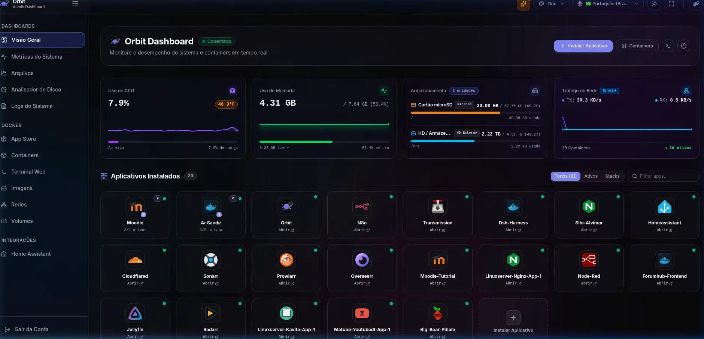
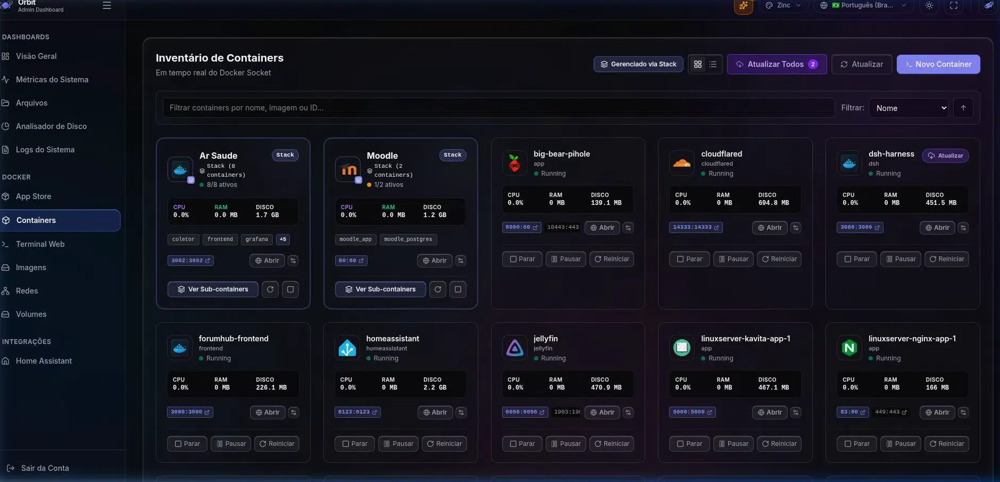
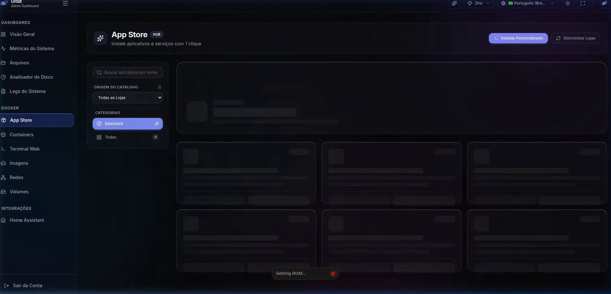
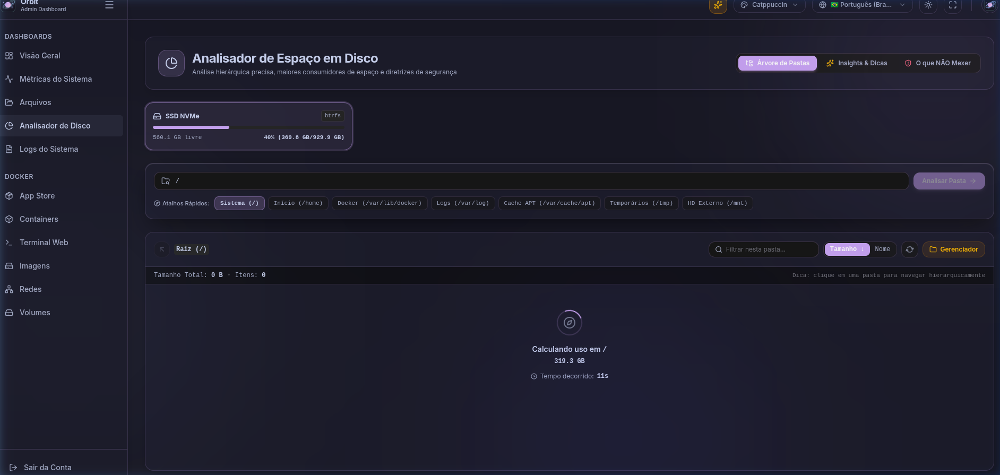
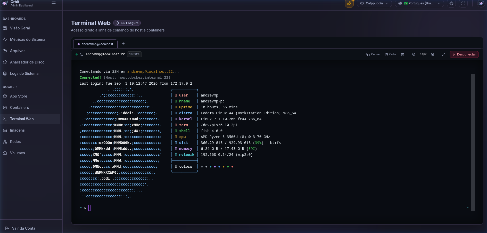
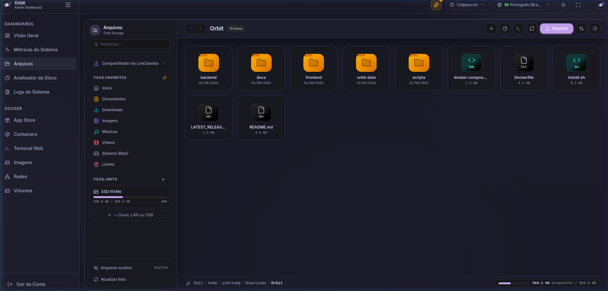
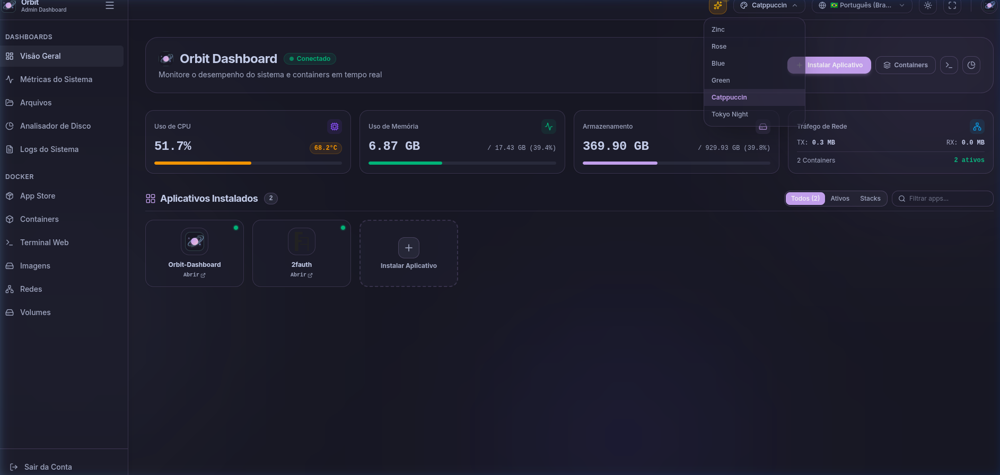

<div align="center">

# 🪐 Orbit Dashboard

**Um painel moderno, ultraleve e de alto desempenho para orquestração de contêineres Docker e telemetria de hardware local.**

[](https://github.com/Andrevictor20/orbit-dashboard/actions/workflows/ci.yml)
[-blue?logo=docker)](https://github.com/Andrevictor20/orbit-dashboard/pkgs/container/orbit-dashboard)
[](https://www.rust-lang.org/)
[](https://react.dev/)
[](https://tailwindcss.com/)
[](LICENSE)

<br/>

[🚀 Início Rápido](#-início-rápido-1-comando) •
[✨ Funcionalidades](#-funcionalidades-completas) •
[🏛️ Arquitetura](#-arquitetura--stack-tecnológica) •
[🤝 Créditos](#-créditos--inspiração) •
[📚 Documentação](#-documentação-completa)

</div>

---

## 📸 Demonstração Visual & Funcionalidades

Veja o Orbit em ação através de nossa interface fluida e focada em performance.

### 🌌 Visão Geral & Dashboard Interativo
Uma visão consolidada de todas as instâncias em execução, status do host (Uptime, IP) e atalhos rápidos para configurações vitais.


### 📦 Gerenciamento Completo de Contêineres
Visualize todos os seus contêineres. Pare, inicie, reinicie ou pause com um clique. Acompanhe a saúde de cada serviço através de badges dinâmicos e consumo individualizado.


### 🛍️ App Store Integrada (1-Click Install)
Explore uma loja com dezenas de aplicações populares (Plex, Pi-hole, Nextcloud, Nginx Proxy Manager). Instalação via manifests otimizada e imediata sem precisar usar linha de comando.


<details>
<summary><b>🔍 Clique para ver mais capturas de tela do sistema (Métricas, Logs e Terminal)</b></summary>
<br/>

| Tela | Prévia |
| :--- | :--- |
| **📈 Gráficos Detalhados de Métricas (CPU/RAM/Rede)** |  |
| **💽 Análise de Disco e Processos** |  |
| **📋 Logs Centralizados e Histórico** |  |
| **💻 Terminal Web Embutido (Xterm.js)** |  |
| **🔐 Tela de Login Segura (Argon2id)** |  |
| **📁 Gerenciador de Arquivos** |  |
| **🎨 Mudanças de Temas** |  |

</details>

---

## ✨ Funcionalidades Completas

O Orbit foi desenhado do zero para não deixar a desejar em nenhum aspecto crítico de homelabs e edge computing:

- ⚡ **Desempenho Ultrarrápido:** Backend construído nativamente em **Rust (Axum + Tokio)**. Consome **menos de 15MB de memória RAM** em repouso e responde em microssegundos.
- 📊 **Telemetria ao Vivo e Detalhada via WebSockets:** 
  - Gráficos históricos interativos e em tempo real de **CPU**, **Memória RAM** e **Tráfego de Rede** (RX/TX).
  - Listagem completa de discos montados com espaço disponível vs consumido.
  - Monitor ativo dos **processos mais pesados** rodando no host.
- 📦 **Controle Total do Ecossistema Docker:** 
  - **Ações de Ciclo de Vida:** Inicie, pare, reinicie, pause e destrua contêineres e imagens.
  - **Inspetor de Contêineres:** Visualize logs detalhados, variáveis de ambiente configuradas, mapeamentos de volumes (bind mounts) e portas ativas sem sair do navegador.
- 🛍️ **App Store Nativa:** Instale ferramentas *self-hosted* essenciais com um único clique (Vaultwarden, AdGuard Home, Jellyfin, etc.). O instalador valida portas e gerencia toda a complexidade do compose internamente.
- 💻 **Terminal Web Avançado (Xterm.js):** Conexões WebSocket seguras que provém acesso direto ao shell de qualquer contêiner rodando (`docker exec` direto no browser) ou terminal SSH do host local.
- 🛡️ **Segurança Zero-Config by Default:** 
  - Autenticação local fortalecida com o algoritmo **Argon2id** (padrão de mercado para hashes seguros).
  - Gestão de Sessão: Geração automática rotacionada de segredos JWT com CSPRNG.
  - Rate Limiting e proteções automáticas contra brute-force embutidas na fundação HTTP.
- 🔄 **Multi-Arch (Edge Computing e IoT):** Imagens Docker empacotadas via CI para **x86_64 (`linux/amd64`)** e **ARM64 (`linux/arm64`)**, garantindo suporte de classe mundial para Raspberry Pi, Orange Pi e mini-PCs.

---

## 🚀 Início Rápido (1 Comando)

### ⚡ Instalação Automática (Estilo CasaOS - Recomendado)
Instalação completa e imediata com detecção automática de arquitetura (**ARM64, ARMv7 ou x86_64**), instalação de dependências e Docker se necessário, criação da pasta de dados e inicialização:

```bash
curl -fsSL https://raw.githubusercontent.com/Andrevictor20/orbit-dashboard/main/install.sh | bash
```

---

### 🐳 Instalação Manual via Docker Compose

Caso prefira iniciar manualmente, utilize a stack declarativa abaixo:

```yaml
services:
  orbit:
    image: ghcr.io/andrevictor20/orbit-dashboard:latest
    container_name: orbit-dashboard
    restart: unless-stopped
    ports:
      - "5172:5172"
    volumes:
      - /var/run/docker.sock:/var/run/docker.sock
      - orbit_data:/app/data
    logging:
      driver: "json-file"
      options:
        max-size: "10m"
        max-file: "3"

volumes:
  orbit_data:
```

```bash
docker compose up -d
```

Acesse **`http://<ip-do-servidor>:5172`** e configure sua conta de administrador no assistente de primeiro acesso.

---

## 🏛️ Arquitetura & Stack Tecnológica

```
┌─────────────────────────────────────────────────────────────┐
│                   Navegador Web (SPA)                       │
│      React 19 + TypeScript + Vite 8 + Tailwind CSS v4       │
└──────────────────────────────┬──────────────────────────────┘
                               │ HTTP REST & WebSockets
┌──────────────────────────────▼──────────────────────────────┐
│                    Orbit Backend Daemon                     │
│                Rust 2021 + Axum + Tokio Runtime             │
├──────────────────────────────┬──────────────────────────────┤
│ Módulo Docker (Bollard API)  │ Módulo Auth (Argon2id + JWT) │
│ Parser Store (CasaOS Schema) │ WebSocket Broadcaster (Sys)  │
└──────────────────────────────┬──────────────────────────────┘
                               │ Unix Domain Socket
┌──────────────────────────────▼──────────────────────────────┐
│              Docker Daemon & Linux Kernel (/proc)           │
└─────────────────────────────────────────────────────────────┘
```

- **Backend:** Rust, Axum, Tokio, Bollard (Docker Client), Sysinfo, Argon2, JsonWebToken.
- **Frontend:** React 19, TypeScript, Vite, Tailwind CSS v4, Recharts, Xterm.js, Lucide Icons.
- **Qualidade & CI:** Vitest, Playwright (E2E e Visual), Grafana k6 (Carga), OWASP ZAP (DAST), Cargo Mutants.

---

## 🤝 Créditos & Inspiração

O design de experiência de usuário e o ecossistema de catálogo de aplicativos do Orbit foram fortemente inspirados pelo projeto de código aberto **[CasaOS](https://casaos.io/)** (da IceWhale Technology). 

Reconhecemos e agradecemos à comunidade do CasaOS pelo excelente trabalho ao popularizar a experiência simplificada de homelabs e o formato declarativo de aplicativos Docker Compose. O Orbit reimagina esses conceitos combinando-os com um backend moderno em **Rust** focado em baixo consumo de memória, segurança corporativa e alto desempenho.

---

## 📚 Documentação Completa

Para se aprofundar em cada aspecto do Orbit, consulte nossos guias dedicados:

- 🏛️ **[docs/ARCHITECTURE.md](docs/ARCHITECTURE.md):** Arquitetura interna, fluxo de dados e design de módulos.
- 🛡️ **[docs/SECURITY.md](docs/SECURITY.md):** Controles de segurança, DevSecOps, Argon2id, headers HTTP e DAST.
- 📦 **[docs/INSTALLATION.md](docs/INSTALLATION.md):** Guia detalhado de instalação via Docker, compilação manual e dev mode.
- 🧪 **[docs/TESTING.md](docs/TESTING.md):** Estratégia de testes, TDD, suíte E2E, carga e pipeline de CI.

---

## 📄 Licença

Distribuído sob a licença **MIT**. Consulte `LICENSE` para mais informações.
