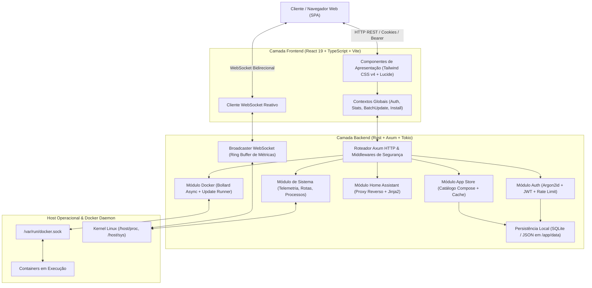

# Arquitetura do Sistema - Orbit Dashboard

Este documento descreve a arquitetura interna, o modelo de concorrência, a organização de diretórios e os padrões de engenharia adotados no Orbit Dashboard.

---

## 1. Visão Geral da Arquitetura

O Orbit é estruturado segundo uma arquitetura de cliente-servidor em camadas com acoplamento fraco:

- **Frontend SPA (Single Page Application):** Interface web desenvolvida em React 19 e TypeScript com Tailwind CSS v4, consumindo dados via chamadas REST HTTP/1.1 e fluxos contínuos via WebSockets.
- **Backend Daemon (API & Serviços de Fundo):** Servidor assíncrono em Rust baseado no framework Axum e runtime Tokio, comunicando-se diretamente com o Docker Engine via Unix Domain Socket (`/var/run/docker.sock`) e com o kernel Linux através de pseudo-sistemas de arquivos (`/proc` e `/sys`).
- **Camada de Persistência:** Armazenamento local leve baseado em arquivos JSON e SQLite hospedados em volume dedicado (`/app/data`), sem dependência de instâncias externas de banco de dados.



---

## 2. Stack Tecnológica

### Backend (Rust)
| Componente | Crate / Biblioteca | Função Arquitetural |
| :--- | :--- | :--- |
| **Framework Web** | `axum` (v0.8) | Roteamento HTTP modular, injeção de estado via `State` e middlewares |
| **Runtime Assíncrono** | `tokio` (v1) | Execução concorrente não-bloqueante baseada em threads de trabalho configuradas |
| **Alocador Global** | `mimalloc` | Alocação de memória de baixa fragmentação com devolução imediata de páginas via `madvise` |
| **Comunicação Docker** | `bollard` | Driver assíncrono para a Docker Engine API sobre Unix Domain Sockets |
| **Telemetria de Sistema**| `sysinfo` | Monitoramento de processadores, memória física, swap e processos do SO |
| **Criptografia & Sessão** | `argon2`, `jsonwebtoken`, `rand` | Hashing resistente de credenciais e geração de tokens JWT assinados via CSPRNG de 64 bytes |
| **Comunicação em Tempo Real** | `tokio-tungstenite` | Servidor WebSocket com difusão de eventos de telemetria e PTY |
| **Pseudo-Terminal** | `portable-pty` | Alocação e controle de sessões interativas de shell no host e em containers |

### Frontend (React & TypeScript)
| Componente | Tecnologia | Função Arquitetural |
| :--- | :--- | :--- |
| **Linguagem & Tipagem** | TypeScript (`verbatimModuleSyntax: true`) | Verificação estática rigorosa de tipos sem emissão de código invisível em runtime |
| **Biblioteca de UI** | React 19 | Renderização reativa declarativa com memoização (`React.memo`, `useMemo`) |
| **Ferramenta de Build** | Vite | Compilação otimizada para produção e servidor de desenvolvimento com HMR |
| **Estilização** | Tailwind CSS v4 | Estilização por tokens utilitários com suporte estrito a classes dark (`@custom-variant dark`) |
| **Gráficos** | Recharts | Renderização de gráficos de área e séries temporais com dados de buffers contínuos |
| **Terminal Web** | `@xterm/xterm` | Emulação compatível com VT100/ANSI conectada via WebSocket |
| **Internacionalização** | `i18next` + `react-i18next` | Suporte nativo e verificado a múltiplos idiomas (`pt` e `en`) |

---

## 3. Módulos do Backend e Padrões de Implementação

### 3.1 Módulo Docker (`backend/src/docker/`)
Para cumprir a diretriz de arquivos coesos (< 500 linhas por unidade), o subsistema Docker foi particionado em submódulos especializados:

- **`containers.rs`:** Endpoints REST de controle de ciclo de vida (start, stop, restart, pause, kill) e listagem consolidada de instâncias.
- **`port_prioritization.rs`:** Algoritmo determinístico para descoberta e pontuação de portas web. Avalia mapeamentos IPv4/IPv6, portas padrão em `network_mode: host` e portas bem conhecidas (80, 443, 8080, 8123, 3000), sintetizando a URL principal de acesso do container.
- **`stats.rs`:** Coleta e cálculo estatístico de CPU, memória, I/O de rede e disco dos containers.
  - *Cálculo de Memória Resiliente:* Aplica o algoritmo canônico da Docker CLI (`calculateMemUsageUnixNoCache`), subtraindo apenas páginas de cache inativas (`inactive_file`).
  - *Fallback para Ambientes Homelab:* Caso o kernel da distribuição (ex.: Raspberry Pi OS ou container LXC) não possua contabilidade de memória em cgroups ativada (`cgroup_enable=memory`), consulta os processos do container via `docker.top_processes` e calcula o somatório do Resident Set Size (RSS) das tabelas `/proc/<pid>/statm`.
- **`updates.rs`:** Inspeção paralela de imagens em registros remotos (Docker Hub, GHCR, Quay, registries privados) utilizando streams concorrentes com limite de janelas (`buffer_unordered`), reduzindo o tempo de consulta de dezenas de containers de minutos para menos de 2 segundos.
- **`update_runner.rs`:** Motor assíncrono de atualização. Executa pulls e builds em segundo plano via tarefas `tokio::spawn`, transmitindo o progresso de download linha a linha com sanitização de códigos ANSI e suporte a cancelamento sob demanda via `CancellationToken`.

### 3.2 Módulo de Sistema (`backend/src/system/`)
- **`network.rs`:** Identificação determinística da interface primária de internet do host lendo a tabela de rotas do kernel em `/host/proc/1/net/route` (ou `/proc/1/net/route`), selecionando a rota padrão (destino `00000000`) com a menor métrica e descartando adaptadores virtuais (`docker0`, `veth*`, `tailscale*`, `br-*`). Extrai contadores de bytes transmitidos/recebidos via `/host/proc/1/net/dev`.
- **`processes.rs`:** Monitor de processos com suporte a leitura em `/host/proc`. Agrupa threads do kernel (`kthreadd`), calcula utilização delta de CPU e impõe bloqueios contra terminação (`kill_process`) direcionada ao PID do Orbit, PID 1 e daemons de infraestrutura do sistema.
- **`disks.rs`:** Varredura e classificação de pontos de montagem, identificando dispositivos físicos (NVMe, SSD SATA, cartões microSD, unidades USB) e volumes de armazenamento.

### 3.3 Módulo de Telemetria e WebSocket (`backend/src/ws.rs`)
- Implementa um loop centralizado de amostragem periódica (intervalo de 1000ms) que consolida métricas do host e de todos os containers ativos em uma estrutura `SystemStats`.
- Mantém um buffer circular em memória (`VecDeque`) para retenção temporal de métricas de rede, CPU e RAM, permitindo que novos clientes conectados ao painel recebam imediatamente o histórico recente de curvas sem aguardar a acumulação de novos ciclos.

### 3.4 Módulo Home Assistant
- Fornece um proxy reverso autenticado para instâncias locais do Home Assistant.
- O backend injeta as credenciais de Long-Lived Access Token, prevenindo a exposição de chaves no cliente e eliminando restrições de Cross-Origin Resource Sharing (CORS).
- Consulta a API de templates do Home Assistant (`POST /api/template`) para extrair áreas físicas dinâmicas e agrupamentos de dispositivos de hardware (`HADeviceGroup`).

---

## 4. Arquitetura do Frontend

O código-fonte do frontend está localizado em `frontend/src/` e segue uma separação modular por domínios funcionais:

```
frontend/src/
├── components/
│   ├── docker/               # Gerenciamento de containers e stacks
│   │   └── container-list/   # Subcomponentes coesos (Grid, Table, Filters, Actions)
│   ├── files/                # Gerenciador de arquivos, editor de texto e analisador
│   ├── homeassistant/        # Cards consolidados de dispositivos e controles
│   ├── layout/               # Shell de navegação, Sidebar, DashboardLayout e Topbar mobile
│   └── metrics/              # Gráficos Recharts, MiniSparklines e métricas de host
├── contexts/
│   ├── AuthContext.tsx       # Estado de sessão JWT e usuário administrador
│   ├── BatchUpdateContext.tsx# Fila global e persistente de atualização de containers
│   ├── InstallContext.tsx    # Fila de instalação de apps da loja
│   └── StatsContext.tsx      # Buffer de telemetria em tempo real com histórico memorizado
├── pages/                    # Pontos de entrada das rotas (Overview, Containers, Metrics, etc.)
└── locales/                  # Dicionários estritamente tipados para i18n (en.ts, pt.ts)
```

### Regras de Design e Performance no Frontend
1. **Isolamento de Variantes Escuras:** Uso de `@custom-variant dark (&:where(.dark, .dark *));` em `src/index.css`, garantindo que seletores escuros dependam estritamente da presença da classe CSS `.dark` no elemento raiz, sem contaminação pela media query do sistema operacional do cliente.
2. **Conformidade de Acessibilidade (WCAG AA):** Todas as superfícies de texto em temas claros adotam a paleta semântica two-tier contrast, evitando contrastes insuficientes (< 4.5:1) em badges, caixas cinzas e modais.
3. **Ergonomia em Telas Móveis:** Viewports menores que 640px agrupam opções de temas e idiomas no componente `MobilePreferencesDropdown`, mantendo áreas de toque com dimensões mínimas de 36x36px.

---

## 5. Estrutura de Diretórios do Repositório

```
Orbit/
├── backend/                  # Código-fonte do daemon e serviços Rust
│   ├── src/
│   │   ├── auth/             # Autenticação, Argon2id, JWT e rate limiting
│   │   ├── docker/           # Ciclo de vida de containers, stats e updates assíncronos
│   │   ├── files/            # Gerenciamento de arquivos locais e permissões
│   │   ├── store/            # Catálogo e orquestração de manifests Compose
│   │   ├── system/           # Detecção de rede, processos do host e discos
│   │   ├── lib.rs            # Configuração de rotas Axum e middlewares globais
│   │   ├── main.rs           # Ponto de entrada, inicialização de runtime e bind do socket
│   │   └── ws.rs             # Broadcaster WebSocket de telemetria
│   ├── tests/                # Testes de integração de rotas e segurança
│   └── Cargo.toml            # Dependências e perfis de compilação (dev/release)
├── frontend/                 # Aplicação SPA React
│   ├── src/                  # Componentes, contextos, páginas e estilos
│   ├── e2e/                  # Testes funcionais e de regressão visual com Playwright
│   ├── package.json          # Dependências e scripts de build/teste
│   ├── vite.config.ts        # Configuração do empacotador Vite
│   └── vitest.config.ts      # Configuração de harness para testes unitários
├── docs/                     # Documentação técnica e guias de governança
├── scripts/                  # Scripts operacionais e checadores de recursos
├── docker-compose.yml        # Manifesto de implantação em produção
├── Dockerfile                # Build multi-etapa e multi-arquitetura (amd64 / arm64)
└── install.sh                # Script de instalação automatizada em ambiente Linux
```
