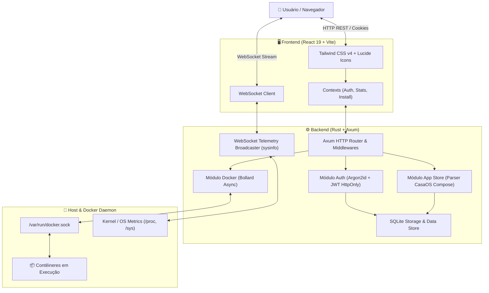

# 🏛️ Arquitetura do Orbit Dashboard

O **Orbit** é projetado como um painel moderno, ultraleve e de alto desempenho para orquestração de contêineres e telemetria de hardware local, ideal para servidores domésticos (homelabs), VPS e nós edge como o Raspberry Pi.

---

## 📐 Visão Geral da Arquitetura

O sistema adota uma arquitetura em camadas com separação clara de responsabilidades:
- **Frontend SPA:** Interface web reativa, construída em React 19 + Vite com Tailwind CSS v4, consumindo dados via REST e WebSockets.
- **Backend API & Daemon:** Servidor concorrente assíncrono em Rust usando **Axum** e **Tokio**, comunicando-se diretamente com o Docker Engine via Unix Domain Socket (`/var/run/docker.sock`).
- **Persistência de Dados:** Banco local SQLite / arquivos estruturados em volume isolado (`data/`), dispensando dependência de banco de dados externo.



---

## 🛠️ Stack Tecnológica

### Backend (Rust)
| Componente | Biblioteca / Crate | Propósito |
| :--- | :--- | :--- |
| **Web Framework** | [`axum`](https://github.com/tokio-rs/axum) | Roteamento HTTP modular e de alta performance |
| **Async Runtime** | [`tokio`](https://tokio.rs/) | Execução assíncrona concorrente sem bloqueio |
| **Docker Engine API** | [`bollard`](https://github.com/fussybeaver/bollard) | Driver nativo Rust assíncrono para a Docker API |
| **Telemetria de Sistema**| [`sysinfo`](https://github.com/GuillaumeGomez/sysinfo) | Coleta em tempo real de CPU, RAM, Disco e Temperatura |
| **Criptografia & Auth** | [`argon2`](https://github.com/RustCrypto/password-hashes), [`jsonwebtoken`](https://github.com/Keats/jsonwebtoken) | Hashing resistente de senhas e tokens de sessão |
| **Comunicação em Tempo Real** | [`tokio-tungstenite`](https://github.com/snapview/tokio-tungstenite) | WebSocket bidirecional para métricas e terminal interativo |

### Frontend (React & TypeScript)
| Componente | Tecnologia | Propósito |
| :--- | :--- | :--- |
| **Framework** | [React 19](https://react.dev/) + [TypeScript](https://www.typescriptlang.org/) | Reatividade, tipagem estática e componentes modulares |
| **Build Tool** | [Vite 8](https://vite.dev/) | HMR instantâneo e bundling otimizado |
| **Estilização** | [Tailwind CSS v4](https://tailwindcss.com/) | Design moderno com tema escuro, glassmorphism e micro-animações |
| **Gráficos** | [Recharts](https://recharts.org/) | Visualização fluida do histórico de métricas de CPU e Memória |
| **Terminal Web** | [@xterm/xterm](https://xtermjs.org/) | Emulação completa de terminal SSH/Exec no navegador |
| **Ícones & Notificações** | [`lucide-react`](https://lucide.dev/), [`react-hot-toast`](https://react-hot-toast.com/) | Feedback visual e ícones de interface |

---

## 🔄 Fluxos de Dados Principais

### 1. Telemetria em Tempo Real via WebSocket
1. O cliente abre uma conexão persistente em `ws://<host>:5172/api/docker/stats`.
2. O backend inicia uma task `tokio::spawn` em loop (a cada 1s).
3. A crate `sysinfo` coleta os dados de utilização do processador, memória física, swap, atividade de I/O de disco e rede.
4. O payload JSON é transmitido pelo WebSocket diretamente para o `StatsContext` no frontend, atualizando gráficos e mostradores sem recarregar a página.

### 2. Integração com Docker & Instalação da App Store
1. A **App Store** sincroniza definições de aplicativos padronizados (compatíveis com manifestos CasaOS Compose).
2. Na instalação de um aplicativo, o backend valida o manifesto YAML, cria volumes/redes dedicadas e aciona o pull de imagens assincronamente através do `bollard`.
3. O progresso do download de camadas do Docker é transmitido via polling ou eventos para a modal de progresso no frontend.

---

## 📂 Organização dos Diretórios

```
Orbit/
├── backend/                  # Código-fonte da API em Rust
│   ├── src/
│   │   ├── auth.rs           # Autenticação, Rate Limit, Argon2id, JWT
│   │   ├── docker.rs         # Gerenciamento de containers, imagens, redes, volumes
│   │   ├── ws.rs             # WebSocket de telemetria e stats
│   │   ├── ssh.rs            # Terminal web interativo via pty/ws
│   │   ├── store.rs          # Parser de apps CasaOS e orquestrador de instalação
│   │   ├── logs.rs           # Leitor assíncrono de logs do sistema
│   │   └── lib.rs            # Roteador Axum principal e middlewares de segurança
│   ├── tests/                # Testes unitários e de integração (Rust)
│   └── load-tests/           # Scripts k6 de teste de carga
├── frontend/                 # Aplicação SPA React
│   ├── src/
│   │   ├── components/       # Componentes visuais (Cards, Modals, Terminal, Layout)
│   │   ├── contexts/         # Estado global (AuthContext, StatsContext, InstallContext)
│   │   ├── pages/            # Telas principais (Overview, Containers, Store, Metrics, etc.)
│   │   └── tests/            # Testes unitários frontend (Vitest)
│   ├── e2e/                  # Testes end-to-end e regressão visual (Playwright)
│   └── public/               # Assets estáticos
├── docs/                     # Documentação modular do projeto
├── docker-compose.yml        # Manifesto oficial de implantação Docker
└── Dockerfile                # Build multi-arch (amd64 / arm64) otimizado
```
