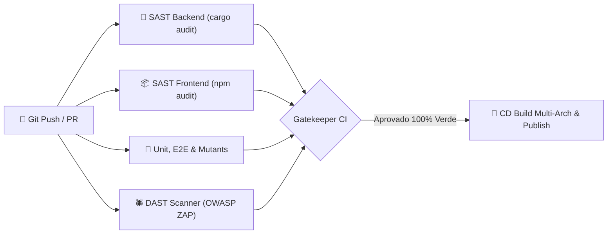

# 🛡️ Segurança e DevSecOps no Orbit Dashboard

O Orbit Dashboard foi desenvolvido sob os princípios de **Secure Software Development Lifecycle (SSDLC)** e **Privacy & Security by Design**. Esta documentação detalha as camadas de defesa, os controles criptográficos e as rotinas automatizadas de validação de segurança contínua.

---

## 🔒 Princípios de Segurança Implementados

### 1. Experiência Zero-Config com Segurança Criptográfica
Ao contrário de ferramentas tradicionais que exigem senhas padrão fracas (como `admin:admin`) ou que dependem de variáveis `.env` vulneráveis a vazamentos acidentais no Git:
- O Orbit implementa um fluxo de **First Boot Wizard (`/setup`)**: ao iniciar pela primeira vez, o dashboard bloqueia qualquer rota e exige a criação de uma conta de administrador segura.
- O segredo de assinatura do JWT (`JWT_SECRET`) é gerado automaticamente usando gerador criptográfico de números pseudo-aleatórios (CSPRNG) e persistido com permissões restritas no diretório de dados (`data/jwt.secret`).

### 2. Armazenamento Seguro de Credenciais (Argon2id)
- As senhas dos usuários nunca são armazenadas em texto plano.
- O Orbit utiliza o algoritmo **Argon2id** (vencedor do *Password Hashing Competition*), com parâmetros de custo de memória e tempo calibrados para mitigar ataques de força bruta acelerados por GPU/ASIC.

### 3. Proteção Contra Força Bruta & Rate Limiting
- O endpoint `/api/auth/login` possui controle de taxa de requisições por IP.
- Múltiplas tentativas incorretas consecutivas acionam um bloqueio temporário (retornando status `HTTP 429 Too Many Requests`), impedindo ataques de enumeração e força bruta em massa.

### 4. Headers de Proteção HTTP (Hardening)
O backend Axum injeta em todas as respostas os cabeçalhos de segurança recomendados pelo **OWASP Secure Headers Project**:

| Header | Configuração | Proteção |
| :--- | :--- | :--- |
| `X-Frame-Options` | `DENY` | Previne ataques de Clickjacking em iframes |
| `Content-Security-Policy` | `default-src 'self'; ...` | Bloqueia injeção de scripts maliciosos (XSS) |
| `Strict-Transport-Security` | `max-age=31536000; includeSubDomains` | Força conexões HTTPS seguras |
| `Referrer-Policy` | `strict-origin-when-cross-origin` | Evita vazamento de caminhos de URL internos |
| `X-Content-Type-Options` | `nosniff` | Impede ataques de sniffing de tipo MIME |

### 5. Isolamento e Comunicação com o Docker Daemon
- A comunicação com o Docker ocorre exclusivamente através do Unix Domain Socket (`/var/run/docker.sock`).
- O container do Orbit é executado sem privilégios desnecessários adicionais, expondo apenas as portas essenciais de serviço.

---

## 🤖 Pipeline Automatizado de DevSecOps (CI/CD)

A segurança no Orbit não é uma etapa manual realizada no fim do ciclo, mas um portão automatizado de verificação em cada *push* e *pull request*:

1. **SAST Backend (`cargo-audit`):** Verifica periodicamente o banco de vulnerabilidades da RustSec Advisory Database, bloqueando dependências com CVEs conhecidas.
2. **SAST Frontend (`npm audit`):** Analisa a árvore de dependências do JavaScript contra vulnerabilidades de severidade Alta ou Crítica.
3. **DAST (OWASP ZAP API Scan):** O OWASP Zed Attack Proxy analisa ativamente todos os endpoints HTTP do backend procurando falhas de injeção SQL/Comando, exposição de erros ou vazamento de cabeçalhos.
4. **Testes de Mutação (`cargo-mutants`):** Valida se as regras de segurança e autenticação (ex: validação de tokens expirados, rate limiting) são cobertas de fato por testes que falham caso a lógica seja alterada.

---

## 🔐 Relato de Vulnerabilidades

Se você identificar qualquer problema de segurança no Orbit Dashboard, pedimos a gentileza de nos enviar um relatório detalhado via GitHub Security Advisories ou abrindo uma issue privada.
